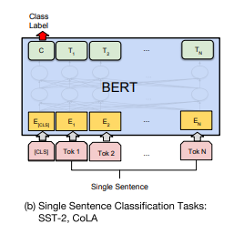

# Homework 4

이번 과제의 목표는 네이버 영화 리뷰 데이터(NSMC)를 사용하여 pre-trained KoBERT 모델을 fine-tuning 시키는 것이며, **single sentence classification task** 에 해당합니다. 현재 공개되어 있는 `KoBERT` 모델의 종류는 다양하나, 본 과제에서는 SKT의 `KoBERT`를 사용합니다. `KoBERT` 의 자세한 모델 정보는 아래의 링크를 통해 확인할 수 있습니다. 

- [SKTBrain/KoBERT](https://github.com/SKTBrain/KoBERT)

추가적으로, **모델의 성능을 개선시킬시에 가산점이 부여**됩니다.

## Usage
### Training & Evaluating your model

모델의 학습을 진행하기 위해서는 먼저 빈칸으로 되어 있는 코드 부분을 채워넣으셔야 정상 동작합니다. 해당 부분의 코드를 완성시킨 이후에 `main.ipynb` 파일을 실행하시면 됩니다. *(Colab 기준 1 epoch 당 20분 정도 소요)*

현재 주어진 NSMC 데이터셋의 경우에는 학습셋과 평가셋으로만 구성되어 있으므로, 모델의 overfitting 발생 방지를 위해 학습셋을 추가적으로 잘라서 검증셋으로 사용하셔도 됩니다. 단, 해당 경우에는 보고서에 반드시 기재가 필요합니다.

## Submission

KLMS 에 작성한 코드와 보고서를 함께 제출하시면 됩니다. 최종 제출 파일은 '이름_학번.zip' 형태로 제출바라며, 아래의 내용물들은 필수적으로 있어야합니다.

- Source code
- Checkpoint (모델 파라미터)
- Report (**pdf format** & **이름_학번.zip**)

보고서는 아래의 항목들이 필수적으로 있어야 합니다.

Your report should include the following to get credits:

- Fine-tuning 을 어떻게 진행하였는지에 대한 과정 및 모델 설명
    - 예: Single linear layer 하나를 통해 fine-tuning 과정을 진행하였다, `distilkobert` 를 적용해보았다 등
- 성능 비교 분석
    - 정확도 및 f1 score 지표 를 통해 성능 비교 분석
    - 다양한 파라미터 셋팅을 통한 비교 분석
    - 시각화 자료 (train loss 와 dev loss 비교)

## Submission due

**Due date: 12/01 (Wed), 23.59 p.m.**

## References

### Papers
- [BERT: Pre-training of Deep Bidirectional Transformers for Language Understanding](https://arxiv.org/abs/1810.04805) (BERT)

## Contact

문의 사항이 있으시면, 해당 메일로 연락주시면 감사하겠습니다. (passing2961@gmail.com)

